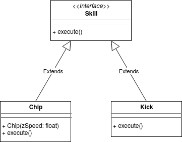
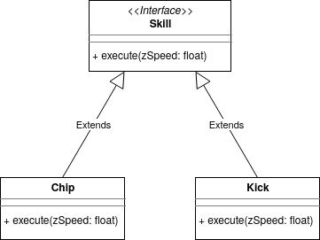
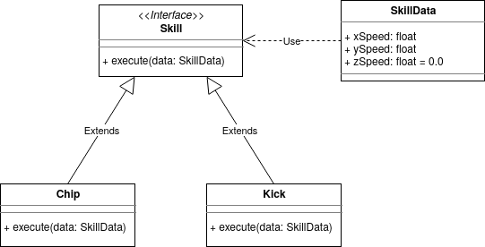
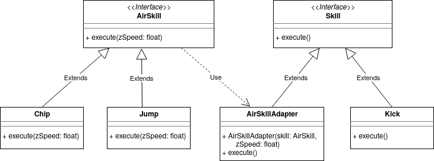
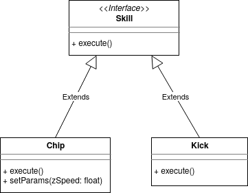

Here is some general non-technical advise when working on the code base, which is applicable for any software developer at any company. When writing code you should take the following points into account:

# Documentation (!= Comments)
## Why?
Code base documentation is very important when writing code, because:
* It makes it easier for other software developers to review your pull requests, since they only have to check if the code corresponds with the specification (documentation) and check if the specification is suitable. Without documentation reviewers have to figure out the specification themselves which takes more time to review the pull request.
* It makes it easier to find bugs in the code, since you just have to compare the documentation with the implementation. If the documentation does not match the implementation then the implementation is supposed to be wrong. Without documentation you have no clue whether something in the code has been implemented intentionally or unintentionally.
* It stimulates re-usage, without documentation other software developers have problems figuring out which functionality is provided by which methods, what preconditions are required and which post-conditions have been satisfied.
* It makes it easier to adhere to the other points: Design, Testing, Consistency, Code cloning/Dead code. For example without documentation it is not even possible to test your code, because you have no specification which you compare the implementation against.
* Your code could stay in the RoboTeam repositories for more than 5 years, when you are long gone from the RoboTeam. The software developers in that team however should understand your code. And every year that passes knowledge about the code base is lost which is kept by proper documentation.

## How?
Keep in mind that documentation is different than comments. Comments are placed between code lines in the source file, whereas documentation is placed in the header file before function and class definitions. Good code should be self-explanatory which means that it often does not need any comments, when properly split into smaller functions that have been well-documented. And when writing comments, it should mostly be used to answer the why questions rather than the what questions, i.e. comments should focus on why does this part of code work, why don't I have to check certain situations, etc. rather than what the code actually does. Documentation on the other hand can be used to explain what the code does, but should also be used to explain why this code works. Documentation should give an answer to the most important questions regarding the code which can include answers on questions like:
* What does the code compute? What is the meaning of the output? What are the postconditions on the output? What is the meaning of the input arguments? Which preconditions should hold on the input arguments? Which requirements should be satisfied before using the code? Etc.
* Is there some known bug/strange behavior in the code which hasn't been solved yet? What happens when preconditions/requirements have been violated? Etc.
* What is the meaning of abbreviations used inside the code? Is there a website which explains (partially) the meaning of the code? From which source has this code been copied? Etc.
* In case of class documentation: Who has written/maintained this code? At which date has this code been written? It's important to know who your point of contact should be in case something isn't sure.
* Less important, but could be included as well: Why does this code work? Why is this code efficient? Why did you choose this type of design? What other solutions have you tried out for this code? What major decisions have been made regarding this code? 

## Good Example
Below is an example how you should document your code:
```
/**
 * Get the intersection between two (finite) LineSegment. Note that this function knows how to deal with LineSegments that are points and how to deal with
 * parallel LineSegments. Moreover this function guarantees to return an intersection point if the LineSegments intersects. In case:
 * - There is a single intersection point then that intersection point is returned.
 * - There are multiple intersection points (infinitely many) which happens when the LineSegments overlap then it prefers to returns 1: start, 2: end, 3: 
 *  line.start of which the first most option is selected that lies on both LineSegments
 *
 * @param line The other (finite) LineSegment.
 * @return std::nullopt if the LineSegments do not intersect. Otherwise return an intersection point.
 */
[[nodiscard]] std::optional<Vector2> intersects(const LineSegment &line) const;
```
Note that this documentation gives a clear description of what the code does, by explaining what happens for each situation. But besides that it also explains why this code works, by telling that the function knows how to deal with parallel & point cases and that you don't have to check if line.end is on the line if start, end and line.start are not on both lines.

## Bad Example
Below is an example how you should not document your code:
```
/**
 * Calculates info for the defenders
 */
void calculateInfoForDefenders() noexcept;
```
The documentation basically tells the same as the name of the function. Hence the goal of documentation, to inform others about usage, is missing here. What kind of info is computed is totally unclear? What are requirements for calling this function is also missing? When should this function be called?

# Design
## Why?
Having a good code design is very important, because:
- It will be much easier to make changes to the code and to introduce new features.
- It will increase the general understandability in the code by other/future software developers which reduces the number of bugs.
- Code with a good design is overall faster than code with a bad design.
- It will increase the productivity of all software developers, because you can all work easily on separate tasks.
- It will be much easier to write and update documentation for your code.
- It will makes it easier to enforce consistency.
- It will reveal code clones and reduce the risk of introducing new code clones.

## How?
Before introducing new features you should discuss with your fellow software developers how you expect the structure of the code that implements these features will look like, since different developers have different opinions about this and they also have to work with it. The following points can help you to find an optimal design for your code:

### Design Patterns
A good place to start when inexperienced with code design is design patterns. Design patterns are quite useful to know as software developers and are applicable to almost any programming language. Design patterns tell you in general how to deal with common types of problems in code design, which can be re-used or guide you in finding a proper design for your situation. A list of all design patterns can be found at https://sourcemaking.com/design_patterns. The most important design patterns to know are: Factory Method, Singleton (although should only be used in a few case), Adapter, Composite, Decorator, Facade, Command, Iterator, Observer, State, Strategy, Template Method. 

### Passing Information
A problem that is quite common in programming is how to pass your information from classes to other classes. There are a lot of different approaches for this and you should be familiar with these approaches and select the right approach for your situation. To better illustrate these approaches, we use as example the Chip skill (chipping is shooting the ball through air). The Chip skill inherits from the Skill interface and for the Chip skill we need to know with which zSpeed the ball should be launched. We will show how data is passed for the Chip skill with each of these approaches. 

#### Pass by Constructor
Pass by Constructor is a quite common practice within the software community, which is a technique where you pass information to the class using its constructor, so when the class is created. In case of the Chip class you will pass the zSpeed as information when the Chip class is created. In a class diagram this solution looks like:



And from a caller perspective it looks like:
```
Skill chip = Chip(5.0)
chip.execute()
```
The pros of this solution is that you enforce that all information that is needed is passed before the corresponding method is called. Furthermore no other class is enforced to use the same parameters if they do not need it. However a clear disadvantage is that information has to be passed when the class is created (which is not always possible) and often the created class can only be used once. For example if we want to Chip with a different zSpeed then we need to create a new Chip class. Although this sound quite complicated, it is a quite common practice to create classes that are only used once.

#### Pass by Interface Method
Pass by Interface Method means that you pass the information by the method inherited from a commonly used interface. In this example we know that the Chip class inherits from the Skill interface. So to pass zSpeed as information, we need to adjust the execute method in the Skill interface such that it uses zSpeed as parameter. In a class diagram this solution looks like:



And from a caller perspective it looks like:
```
Skill chip = Chip()
chip.execute(5.0)
```
The pros of this solution is that it is a quite simple design. Furthermore you can use the same class multiple times and you pass the information when the corresponding method is executed. The con of this solution is that all classes inheriting from this interface are enforced to use the same parameter even if they do not need it. For example Kick is a Skill where the ball is passed over the ground, so there is no need for passing zSpeed as parameter to this class. But with this solution you are enforced to still pass this value to the Kick class. 

#### Pass by Interface Method (Advanced)
With the Pass by Interface Method technique you can also do more advanced stuff, like using optional arguments (https://en.cppreference.com/w/cpp/utility/optional) or using null values in case some information is not needed. Also you could pass a class as parameter that encapsulates the necessary data needed for skills, which looks like:



The advantage of this is that the class parameter could partially deal with the missing values, however a clear disadvantage is that this makes everything more complex than necessary. However if child classes are too different then they should not share the same interface. For example if there is a subgroup of classes that uses different parameters than other classes, they should inherit from a seperate interface. With an adapter pattern you can now substitute the new interface in the old interface, which in case of the Chipping example gives the following class diagram:



Where the implementation of the adapter class looks like:
```
class AirSkillAdapter implements Skill {
  private final AirSkill skill
  private final float zSpeed
  
  AirSkillAdapter(AirSkill skill, float zSpeed) {
    this.skill = skill
    this.zSpeed = zSpeed
  }
  
  void execute() {
    skill.execute(zSpeed)
  }
}
```

#### Pass by Additional Method (Setter)
The third solution is to Pass Information by Additional Method. This additional method is called a setter, which you can create per parameter that needs to be passed or you can have 1 setter function that sets all parameters at once. In a class diagram this solution looks like:



And from a caller perspective it looks like:
```
Skill chip = Chip()
chip.setParams(5.0)
chip.execute()
```

The pros of this solution is that you can pass the information at anytime rather than at the initialization of the class. Furthermore the same class can be used multiple times and you are not enforced to pass parameters to classes that do not need it. The con of this solution however is that it is much more complicated and it is not enforced to pass zSpeed now as parameter before calling execute as method, which also needs to have some exception handling for these cases. Therefore it is not advised to use this solution if either Pass by Interface Method or Pass by Constructor is already an appropriate solution. However in some cases you could combine it with Pass by Constructor to have more flexibility in changing the parameter at anytime, whereas you never have an undefined parameter value.

#### Pass by constant
#### Pass by static

### Naming

### Responsibilities
- Single responsibilities
- Push responsibilities downwards

### Hard Coding
Magic values, assuming things don't change

### Simplicity & Shortness


# Unit Testing
## Why?
Writing unit test cases for your code is very important, because:
- Even the simplest code can contain bugs and even when fully reasoned that the code works, it can still contain some bugs.
- It encourages you to inspect your code better for bugs, because during the process of writing test you might already find bugs (without executing the tests).
- It improves the trust in the code, since it is properly tested and therefore it is less likely that your code suddenly fails during the RoboCup.
- It will help you find the location of bugs.

## How?
When writing unit test cases, your goal is to create unit test cases that might/will fail, not unit test cases that will pass. Also you should be systematic in writing test cases, since using random unit test cases or just writing a few test cases will in most cases not find the most common type of bugs. Hence you should be systematic in writing unit test cases, for which there are 2 type of techniques: black-box testing and white-box testing. With black-box testing you only look at the specification and ignore the implementation. With white-box testing you also take a look at the implementation. Some black-box testing techniques are:

### Equivalence Partitioning 
With this technique you split up your test cases logically up in multiple classes based on the input and/or output. For example in case of the intersection between LineSegments you split it up in: no intersection, 1 intersection, infinitely many intersections. And you can split it up in: parallel lines versus non-parallel lines. The Equivalence Partitioning method proposes you to pick a test cases such that every class is covered at least once. For example in this case you can create 3 test cases:
- Two parallel LineSegments that do not intersect (covers the no intersection class and the parallel class).
- Two non-parallel LineSegments that intersect once (covers the 1 intersection class and the non-parallel class).
- Two equal LineSegments (covers the infinitely many intersections class and the parallel class).
  
which will cover all classes at least once. Equivalence Partitioning is a quite suitable technique that ensures you to look at all different type of cases. More information about Equivalence Partitioning can be found at: https://en.wikipedia.org/wiki/Equivalence_partitioning

### Boundary Value Analysis
Boundary Value Analysis is often combined with Equivalence Partitioning. With Boundary Value Analysis you pick quite huge/small cases, e.g. using INT_MAX, FLT_MIN and vectors of maximum size as test input. Moreover you test input cases that are close to the regions where the output will change. If you apply Boundary Value Analysis on for example the path finding algorithm to the ball, then you can test the following cases:
- Path finding when the entire field is filled with soccer robots.
- Path finding when one of your robots already possesses the ball. 
- Path finding when two of your robots have almost the same distance to the ball, except one of them has a slightly lower distance.
- Path finding for cases when you have a very long path towards the ball.

When combined with Equivalence Partitioning you can test cases that are close to the class boundaries. For example in the LineSegment intersection case you can pick two LineSegments that are almost parallel. More information about Boundary Value Analysis can be found at: https://en.wikipedia.org/wiki/Boundary-value_analysis

### Error Guessing
The last black box testing technique is Error Guessing. With Error Guessing you try to find test cases that might fail. Examples of error guessing are computing the intersection between two LineSegments that are actually points and applying the path finding algorithm when the ball cannot be reached, because it is surrounded by enemy robots. With error guessing you can also look for input which might result in division by zero or taking the logarithm of zero. Also cases where for-loops and while-loops don't get executed at all are interesting for Error Guessing. Or using empty vectors/arrays as input will often result in good test cases as well. Important for Error Guessing is to think outside the box, because for Error Guessing it is less straightforward to find test cases than for Boundary Value Analysis and Equivalence Partitioning. Also it requires more experience than for the previous black box testing techniques. However Error Guessing will definitely help you to find bugs inside your code. 

### White Box Testing
With white box testing you look at the implementation and check which part of the code get covered by the test cases. For this you can use these coverage metrices: statement coverage, (multiple) condition coverage, decision coverage, modified condition/decision coverage and path coverage. More information about these metrices can be found at: https://en.wikipedia.org/wiki/White-box_testing and https://en.wikipedia.org/wiki/Code_coverage. A general guideline is to have decision coverage with your test suite (group of unit test cases) for the method you test, which means that every if, for and while statement has been evaluated at least once to true and once to false. You could aim for even better coverage scores, by having multiple condition coverage, modified condition/decision coverage or path coverage, but make sure that your test suite does not become enormous by doing this.

### Conclusion
Usually a combination of equivalence partitioning, boundary value analysis, error guessing and decision coverage ensures that all common type of bugs will be found. It is unfortunately never a guarantee that all bugs will be found, but you will definitely find more bugs than by just using a few test cases or using random test cases.

The last thing regarding to writing unit test cases is to always use your common sense, e.g.
- Do not write unit test cases for cases which never occurs, however you should keep in mind that other/future software developers might use your functions differently.
- Do not write (a lot of) unit test cases for obvious methods that consists of a few lines, like getters and setters or simple operator overloaded methods.
- Do not test the same at multiple places, if you re-use a properly tested method somewhere then this method does not need to be tested again. You should write test cases based on the assumption that the re-used method works properly.
- Do not test external libraries or functions in the C++ standard library, you can assume that these functions have been properly tested. 

# Consistency
## Why?
Being consistent when writing code is important, because:
- Code is being re-used by other/future software developers that do not expect these consistencies.
- Often it is forgotten to properly document code or documentation of the code is not read, so others are unaware of these inconsistencies.
- Being consistent makes it easier to find a better design.
- It makes it easier to find bugs, since either at all places it goes wrong or it goes wrong at no place at all.

## How?
What I don't mean with consistency is: code style formatting, commit message guidelines, documentation guidelines, etc. which is also quite important, but being consistent in implementation and design of your code is even more important. Unfortunately there is no clear definition of consistency, however some important points regarding consistency are:
- Naming: You should use the same/similar (variable) names when speaking about the same/similar object, values, constants, etc.
- Class: You should treat a class as it is defined. So for example an infinite Line class cannot have methods that interpret it as a finite LineSegment.
- Measures: Make sure that similar methods use similar base units, regarding time, mass and length. So do not have halve of the methods in a class use seconds and the other halve uses milliseconds. Often it is the best approach to express everything in SI base units.
- Parameters: Make sure that if similar methods use similar parameters that the exact definition of those parameters is the same. So for example if you have functions that check if a certain location is in an area using a given margin to extend this area then make sure that the margins of all these functions are either outwards margins or inwards margins. Do not use both at the same time.
- Output: Make sure that the output of similar methods have the same meaning. So when returning a location on the field by different methods, you should make sure that these locations are comparable.
- Exceptions: Exceptions should be dealt with in the same way by similar methods. So either throw an exception, send an error message, ignore it, etc. but never use a combination of these options. Also odd cases should be dealt with in the same way by similar methods, so for example if you compute intersections between objects and there a multiple of them then you should be consistent in what you return for all these methods in different classes.
- Metrics: When using a distance metric in similar methods make sure that you use the same distance metric for all of them. For example in case you check whether two locations (Vector2) are the same then either use Manhattan distance or Euclidean distance everywhere (checking if float values are equal can cause issues due to rounding of float values).

Important regarding consistency is that you should discuss a lot with your fellow software developers on which guidelines/definitions you will agree on. 

# Code Clones

# Dead Code
